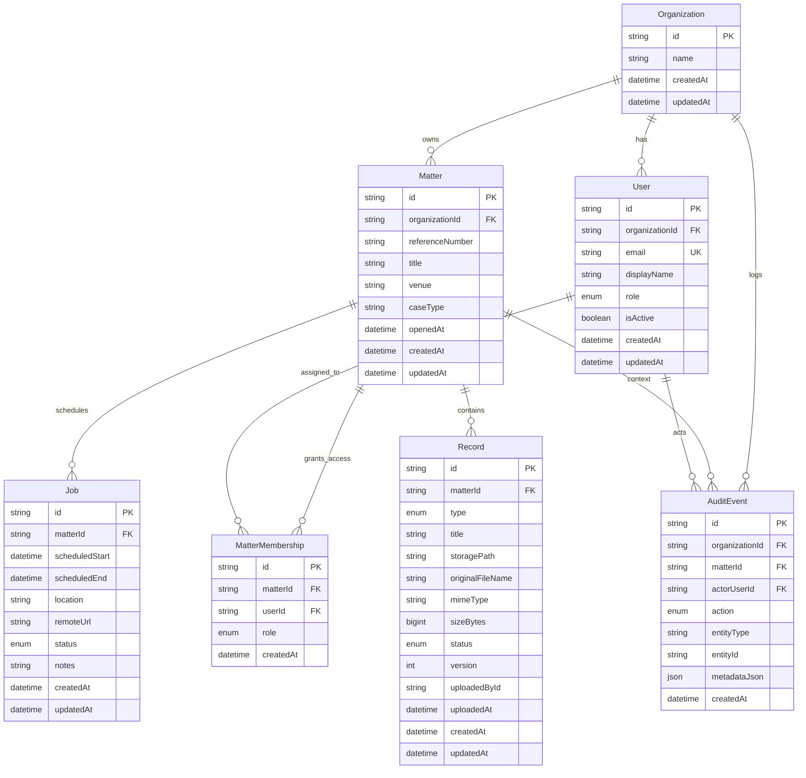

# DB Schema Visual (MyVeritext 2.0)

## Notes
- `Matter` is the core aggregate.
- `MatterMembership` enables matter-scoped RBAC.
- `AuditEvent` captures compliance/traceability actions.
- `Record` stores transcript/exhibit metadata (binary blobs live in GCS).
