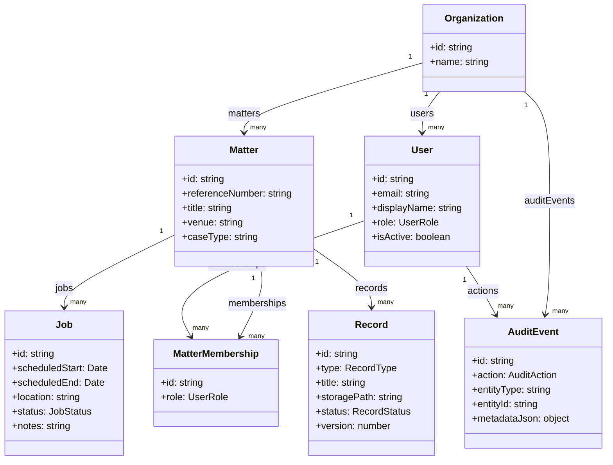

# Object Model Visual

## Domain boundaries
- **Scheduling domain:** `Job`
- **Records domain:** `Record`
- **Access domain:** `User`, `MatterMembership`
- **Compliance domain:** `AuditEvent`
- **Case context domain:** `Matter`
